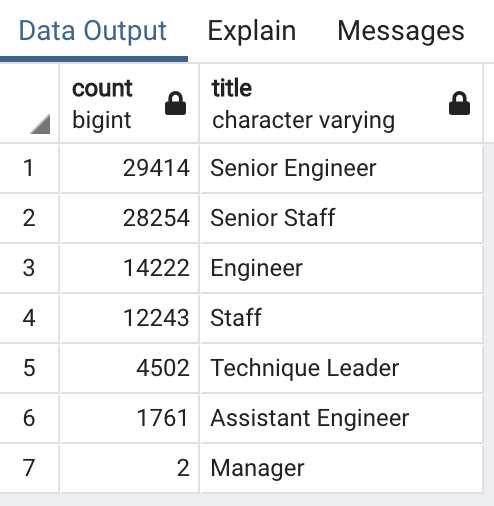
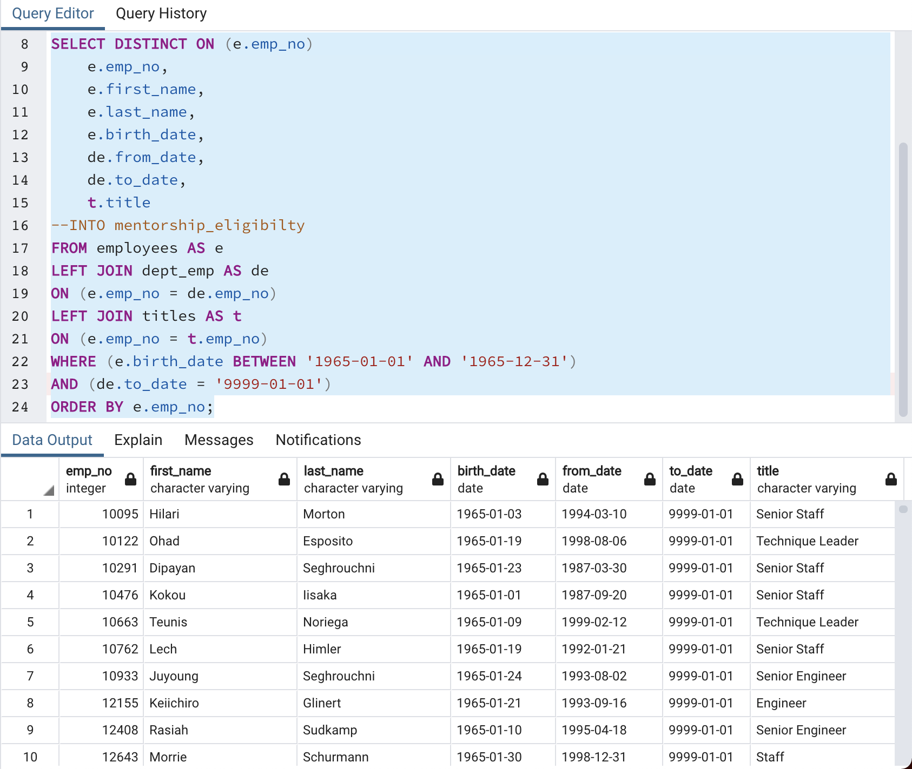

# Pewlett-Hackard-Analysis
The aim of this project was to determine the number of retiring employees per title, and identify employees who are eligible to participate in a mentorship program. Then, report a summary of my analysis that helps prepare management for the “silver tsunami” as many current employees reach retirement age.

## Overview
I was asked to provide two deliverables, specifically:
### The Number of Retiring Employees by Title  
* A query is written and executed to create a Retirement Titles table for employees who are born between January 1, 1952 and December 31, 1955.
* A query is written and executed to create a Unique Titles table that contains the employee number, first and last name, and most recent title. This makes sure the employee's latest title is counted, and previous titles are excluded.
* A query is written and executed to create a Retiring Titles table that contains the number of titles filled by employees who are retiring.
* An export of this information is made available for the management team's review.

### The Employees Eligible for the Mentorship Program
* A mentorship-eligibility table that holds the current employees who were born between January 1, 1965 and December 31, 1965.
* An export of this information is made available for the management team's review.

## Results
Below is a bulleted list with four major points from the two analysis deliverables. 
### The Number of Retiring Employees by Title
* The title with the highest number of retiring employees is Senior Engineer, at 29,414.
* The title with the lowest number of retiring employees is Manager, at 2.
* The combined percentage of staff with senior titles who can retire is 63.7%  (29414 Senior Engineers + 28254 Senior Staff / total 90398 unique employees by title) * 100 = 63.7%

### The Employees Eligible for the Mentorship Program
* With 1549 employees eligible for the mentorship program, most clearly hold a senior title.

## Summary
A mentorship program is essential to retaining some of the organization knowledge and expertise that will be leaving with so many employees eligible for retirement from their senior positions with the company. The phased retirement approach may need to be extended, or provide additional perks to existing employees eligible for retirement to entice them to stay longer than they'd expected - and may increase the recruitability of new hires, who are looking to learn from a mentor. 
There are 1549 employees eligible for the mentor program, which is not nearly enough without assigning multiple people to each mentor. It is highly recommended more processes and work be eliminated if unnecessary, automated if possible, prioriitzed by minimum viable product needed for sustainability, or  outsourced temporarily so that revenues can keep up with the demand during these changes in personnel.
